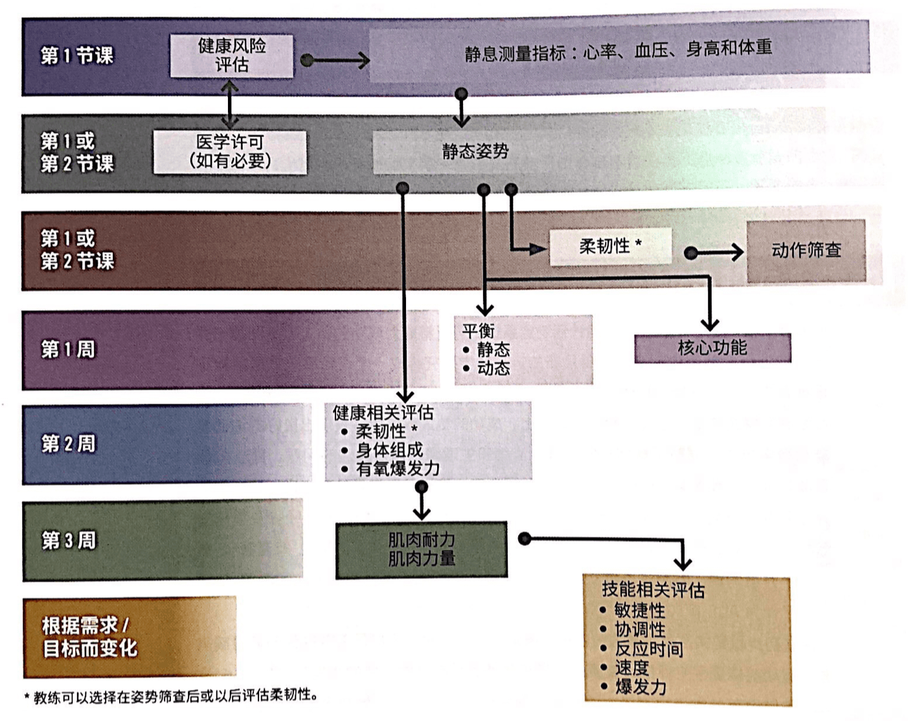

# ACE-IFT 训练模型

书中很多章节里面会有红框标注的重要概念，而第五章全部都是重要概念。

Table of Contents
=================

   * [ACE-IFT 训练模型](#ace-ift-训练模型)
      * [IFT-Integrated Fitness Training](#ift-integrated-fitness-training)
      * [表 5-1 传统与当代生理训练参数](#表-5-1-传统与当代生理训练参数)
         * [传统训练参数](#传统训练参数)
         * [当今训练参数](#当今训练参数)
      * [表 5-2 有氧运动一般建议](#表-5-2-有氧运动一般建议)
         * [FITT-VP](#fitt-vp)
      * [表 5-3 抗组运动一般建议](#表-5-3-抗组运动一般建议)
         * [FITT-VP](#fitt-vp-1)
            * [笔记](#笔记)
      * [功能-健康-体适能-运动表现体系](#功能-健康-体适能-运动表现体系)
         * [评估时间表](#评估时间表)
         * [功能性动作与抗阻训练](#功能性动作与抗阻训练)
         * [心肺训练](#心肺训练)
         * [促进行为变化（一段时间持续运动后）](#促进行为变化一段时间持续运动后)
      * [特殊人群客户](#特殊人群客户)
         * [一般指南](#一般指南)
         * [目标](#目标)

## IFT-Integrated Fitness Training

适用范围：从最基本的生活方式改善，到针对运动表现的训练。

## 表 5-1 传统与当代生理训练参数

### 传统训练参数

+ 心肺适能（有氧）
+ 肌耐力
+ 肌力
+ 柔韧性

### 当今训练参数

+ 稳定性
+ 姿势（动力链）灵活性
+ 动作效率
+ 核心功能
+ 平衡能力
+ 心肺适能，肌耐力，肌力，柔韧性
+ 敏捷性，协调能力，反应力，速度，爆发力
+ 行为改变能力
+ 代谢指标（通气阈）

## 表 5-2 有氧运动一般建议

### FITT-VP

+ Frequency
    + 每周大于等于五天中等强度运动，或者三天的高强度。或者结合。
+ Intensity
    + 大多数成年人：中等或者高等。
    + 身体虚弱：中低强度。
+ Time
    + 30~60min/天中等强度。
    + 20~60min/天剧烈运动。
    + 或者结合
    + <20min的运动对于久坐少动的人来说有益。
+ Type
    + 进行涉及主要肌群的定期针对性运动。
+ Volume
    + 推荐目标运动量 >=500~1000MET每周
    + 建议7000步/天
+ Progress
    + 调整运动持续时间，频率或者强度来进阶

## 表 5-3 抗组运动一般建议

抗阻的目的是增加力量。

RM：Repetition  maximum。

### FITT-VP

+ Frequency
    + 各肌群应该每周两到三天
+ Intensity
    + 新手&中级运动者：60~70% 1RM（中高强度）
    + 经验丰富：80% 1RM（高强度到极高强度）
    + 老年人/久坐少动：40~50%。20~50% 1RM 改善爆发力。
    + <50% 1RM可以增加肌肉耐力。
+ Time
    + 未定
+ Type
    + 各个主要肌群都练
    + 针对主动肌和拮抗肌的多关节运动
    + 多关节运动之后，可以进行相同肌群的单关节活动
    + 先自重再上器械。
    + 笔记：设计方案的时候可以设计8~12组，每组3~5个动作。
+ Volume
    + 重复次数
        + 大多数成年人：重复8~12次可以改善力量和爆发力（增肌）。
        + 中老年人：10~15
        + 肌耐力：15~20
    + 组数
        + 大多数成年人：2~4组（力量和爆发力）
        + 老年人/新手：1组
        + 肌肉耐力：<=2组
    + 模式（pattern），训练节奏
        + 每组之间休息两三分钟
        + 针对同一个肌群的训练之间间隔48小时，也就是中间隔一天
+ Progress
    + 逐步增加阻力/重复次数
    + 以更高频率做动作

#### 笔记

增加阻力以5%为好。

## 功能-健康-体适能-运动表现体系

纲：运动计划应该循序渐进，首先重新建立正常的功能，然后改善健康状况，进而提高体适能（身体素质），最终提高运动表现。

建立在默契关系基础上。行为策略是 ACE-IFT 的基础。

### 评估时间表

健康史-期望和习惯-补充问卷（运动史）-确定如何评估以及执行评估的时间表（七八章）。

客户可能并没有看过医生，所以要测量静息指标。可以在前几次课程中对新客户进行功能性动作/平衡/活动范围的评估，其他评估等进阶的时候做（项目太多，一节课全部在评估了）。

第三周有一点适应了，就去做肌肉耐力测试（第八章）。

P97：有些客户会处于心肺和抗阻模块的不同分期，有些客户会处于相同分期。私教必须要了解

+ 如何评估客户所处分期
+ 在当前分期，怎么设定方案
+ 如何使客户进阶

接下来概述两个模块在各个阶段的特点

### 功能性动作与抗阻训练

- 稳定性与灵活性训练——姿势先对。

    - 改善肌肉平衡，肌肉耐力，核心功能，柔韧性，静态和动态平衡。
    - 身体能力评估：姿态，平衡能力，动作，关节活动度（ROM）。（第七章）
    - 稳定性：普拉提。灵活性：瑜伽。
    - 帮助客户找到**属于自己**的中立姿势。
    - 不损失灵活性的前提下加强稳定性。

- 动作模式训练（第九章）——解决运动控制问题。
    - 加强灵活性，而不影响稳定性。

    - 训练的动作在现实中的对应

        | 动作             | 对应             |
        | ---------------- | ---------------- |
        | 屈髋提起（深蹲） | 坐下站起，捡东西 |
        | 单腿动作         | 上楼             |
        | 推               |                  |
        | 拉               |                  |
        | 旋转             | 脊柱旋转：腰胸椎 |

    - 进阶条件：在这个阶段，不加负重（仅用自重）。可以有效地执行动作模式，并且保持稳定的中立姿势/重心和动作速度。一般是两到八周。

- 负荷训练——产生肌力。评估（第八章）。

    - 训练目标可以是：正向改变身体组成/肌肉力量（例如增强神经的肌肉募集能力）/肌肉肥大/肌肉耐力/好看。
    - 通过改变运动变量达成目的。例如调控重复次数和重量（RM 的百分比），肌肥大8~12，肌力6~8，肌耐力12~15。参见 [FITT-VP 模式](#表 5-3 抗组运动一般建议)。
    - 私教需要在这个阶段保持客户的积极性（第十章）——采用线性或波动周期化模式，从单关节动作进阶到一体化动作。
    - 大多数客户停留很久。如果发现客户有姿态错误，应该返回之前阶段纠正。

- 运动表现训练——专项的训练项目。第十章。

    - 各个运动不一样， ace 不注重这个。
    - 负重阶段可以增加肌肉的力量，但是并没有解决爆发力问题。
        - 爆发力=力×速度=功÷时间。其实就是功率。
        - 涉及快速加减速的训练能够提高爆发力（例如折返跑）。
    - 提高速度/敏捷性/快速反应性（灵敏）/反应力——直接受益于爆发力的增强。尽可能减少肌肉离心和向心运动之间的过渡时间，这样产生的力量越大。
    - 也是一种改变客户身体组成的一个方式，因为第四期消耗能量最大。增加II型肌纤维，于是增加瘦体组织。

### 心肺训练

+ 有氧基础训练——在久坐少动的客户身上开发初始有氧基础（baseline）。

    + 中低等强度：低于 VT1，自感用力度（RPE）3~4。通过谈话测试判断。
    + 使得客户有定期运动的习惯，直到每周进行三到五次，每次20~30分钟。并不需要在 FITT-VP 上增加运动变量的值。

+ 有氧效率训练

    + 中强度： VT1或者略高于 VT1， RPE 为5。乳酸的生成和消耗速度接近。
    + 通过增加课程持续时间，增加课程频率，或者引入间歇性训练（锻炼次数和长度以及休息间歇不同） 提高有氧效率。通过提高 VT1下的运动强度来提高运动耐力，提高客户使用脂肪为燃料源的能力。
    + 可以在该阶段维持多年。

+ 无氧耐力训练——运动员改善耐力项目中的运动表现，提高心肺适应能力

    + 中高强度：VT2附近， RPE 7。HIIT。

        | 强度    | 训练时间百分比 | 训练重点               |
        | ------- | -------------- | ---------------------- |
        | <VT1    | 70%~80%        | 热身，放松，活动性休息 |
        | VT1~VT2 | <10%           | 有氧效率               |
        | VT2     | 10%~20%        | 无氧耐力               |

    + 如果出现过度训练的体征，应该降低频率和强度，增加休息时间。例如静息心率增加，睡眠障碍，或者连续多天饥饿感降低。注意，HIIT 加上额外的生活压力足以导致训练过度。

+ 无氧爆发力训练——增强无氧和有氧爆发力（十一章）

    + 极高强度：远高于 VT2，RPE 9。

    + 许多客户永远不会进入这个分期，因为无氧耐力的挑战已经是他们想要的最高水平训练。

    + 这些极为费力且持续时间短的间歇性训练将导致快速糖酵解系统超负荷，挑战磷酸原系统——所以需要客户有很强的内在激励。

        | 强度    | 训练时间百分比 | 训练重点                                       |
        | ------- | -------------- | ---------------------------------------------- |
        | <VT1    | 70%~80%        | 热身，放松，活动性休息                         |
        | VT1~VT2 | <10%           | 有氧效率                                       |
        | 超过VT2 | 10%~20%        | 持续时间短，回复时间比第三期更长。无氧爆发力。 |

**笔记**：这个表格不仅可以用于第三四期的某一次的训练安排，也可以用于一周一个月或者更长周期的安排。

### 促进行为变化（一段时间持续运动后）

经过两到四周的定期活动，客户一般会体验到更稳定的情绪，因为

+ 激素和神经递质水平会变化
+ 通过实现任务提高了自我效能
+ 神经肌肉适应了运动，从而改善了运动表现（DOMS 之后才会适应）

## 特殊人群客户

详见第十四章。

### 一般指南

1. 客户的医师需要许可他进行运动
2. 客户特定的运动指南来源
    1. 客户的医师提供
    2. 具体指南——十四章
3. 许多客户将会停留在
    1. 心肺第二期
    2. 抗阻第三期

### 目标

1. 开始时让客户轻松获取成就感，就可以提高其坚持度
2. 帮助特殊人群客户进入行动阶段（TTM），并过渡至维持阶段（治未病）
3. 提高总体生活质量