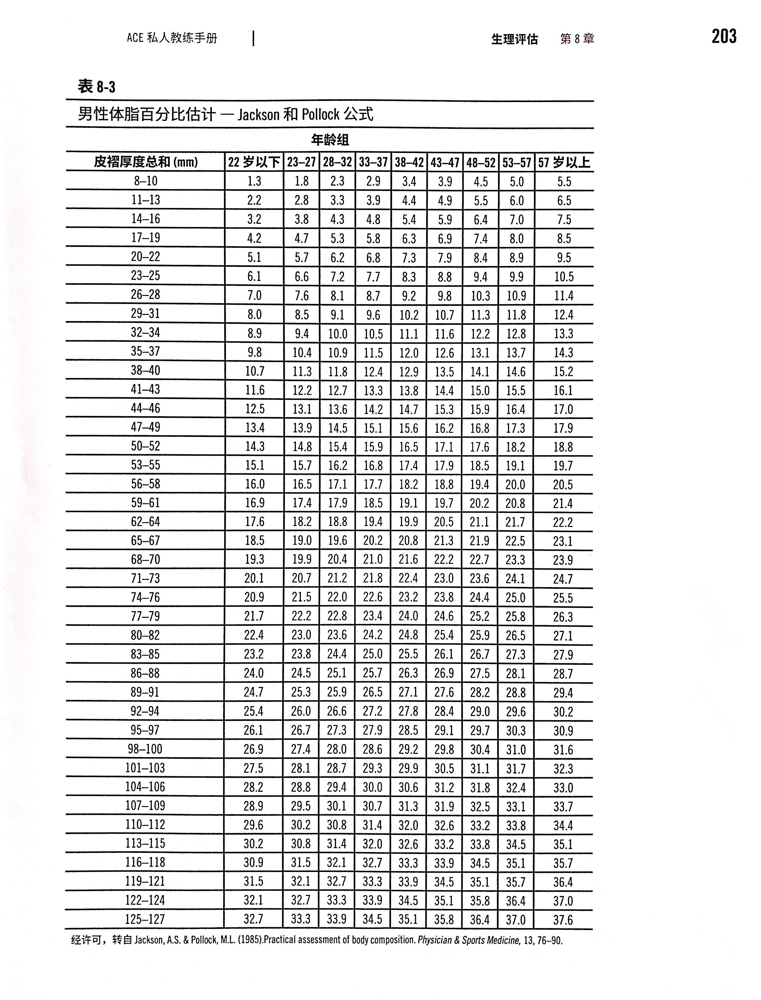
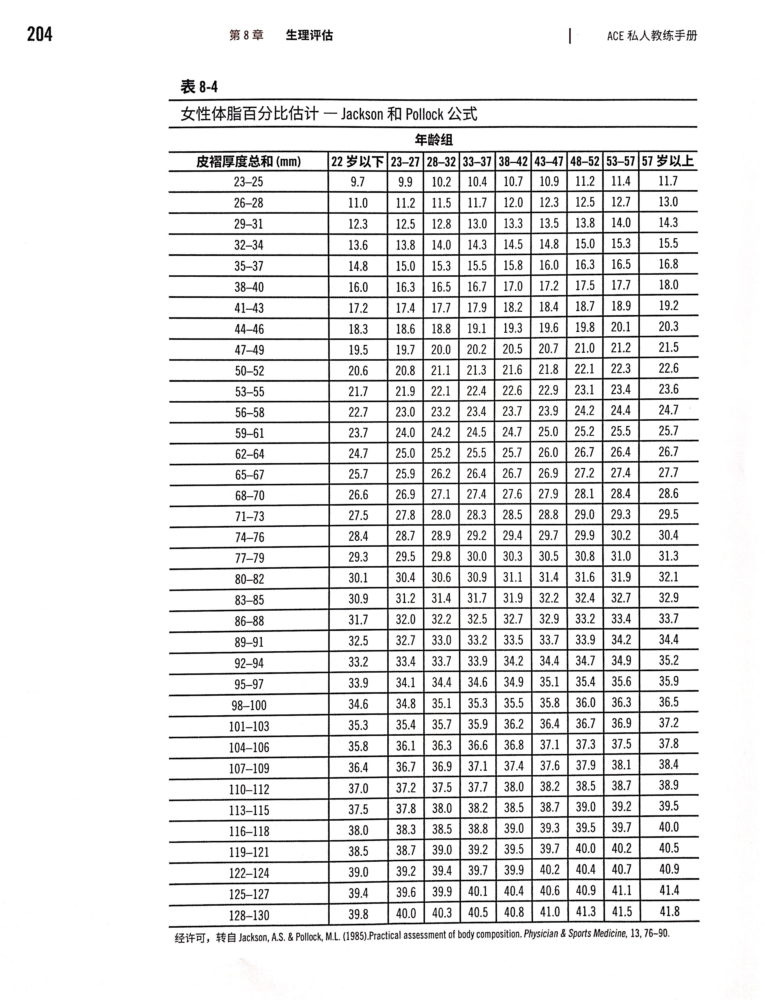
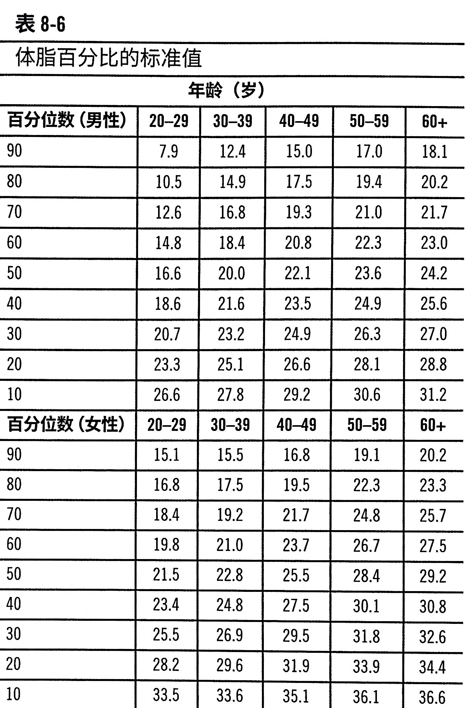
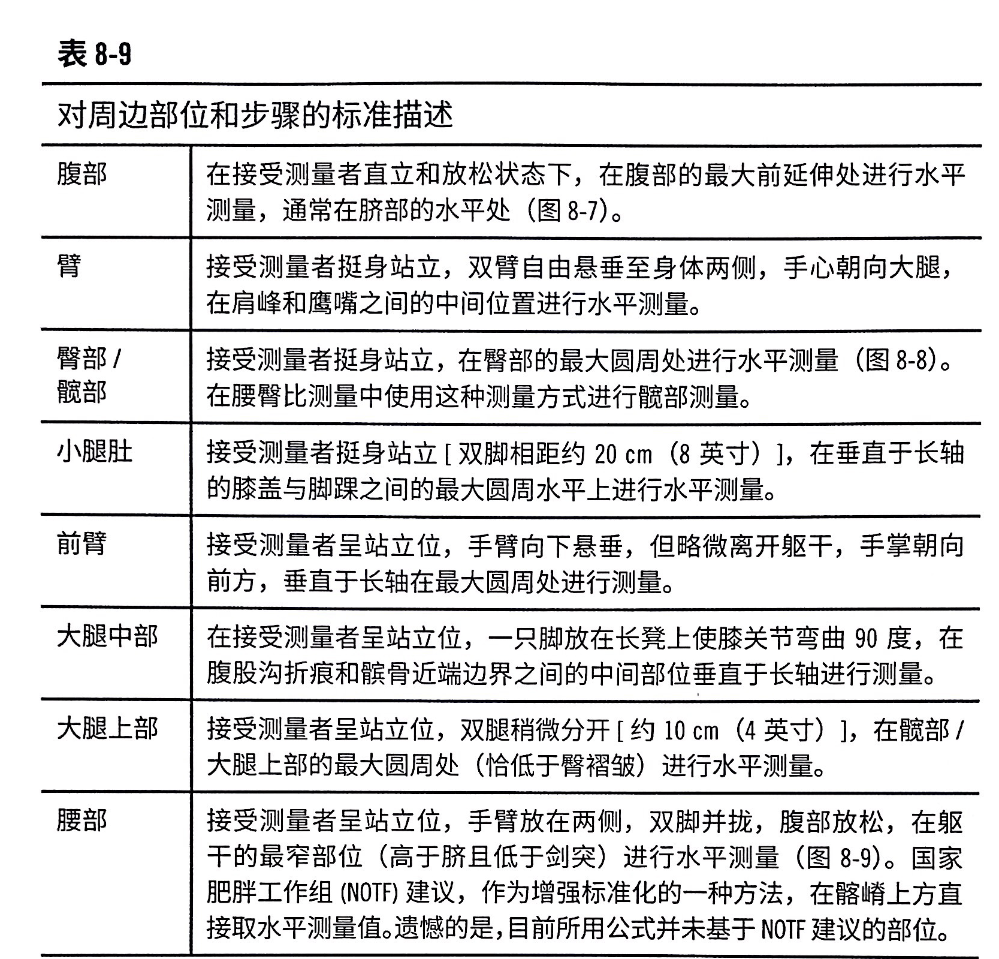

# 生理性评估(1)

评估肌肉力量和耐力，评估心肺适应能力。

健康相关的评估

| 测试项目          | 项目内容                                                 |
| ----------------- | -------------------------------------------------------- |
| 心肺适应能力      | 心肺的总体功能，以及心血管系统向工作肌肉输送氧气的效率。 |
| 身体组成/人体测量 | 身体组成和体脂分布                                       |
| 肌耐力            | 肌群维持重复活动和承受疲劳的能力                         |
| 肌力              | 肌肉克服外部阻力的能力                                   |
| 柔韧性            | 给定关节（组）的活动范围（ROM），或者肌群的伸展能力      |

运动技能相关的评估

| 测试项目     | 项目内容                                                     |
| ------------ | ------------------------------------------------------------ |
| 无氧爆发力   | 功率；最大努力下进行单次、爆炸性的爆发                       |
| 无氧运动能力 | 短时间内，发力的持续性                                       |
| 速度         |                                                              |
| 敏捷性       | 个体如何准确和快速地改变方向；涉及三个阶段：加速、稳定、减速 |
| 反应性       | 个体对刺激进行反应的速度                                     |
| 协调性       | 个体在合适的时间里、用准确的力度完成复杂动作的能力           |

<!--ts-->
   * [生理性评估(1)](#生理性评估1)
      * [测试与测量](#测试与测量)
         * [<strong>停止运动测试的体征和症状</strong>[<strong>重要</strong>]](#停止运动测试的体征和症状重要)
         * [人体测量/身体成分](#人体测量身体成分)
            * [身体组成的概念[重要]](#身体组成的概念重要)
            * [皮脂测量](#皮脂测量)
               * [身体密度计算公式](#身体密度计算公式)
               * [男女性体脂率计算表](#男女性体脂率计算表)
               * [体脂百分比表格](#体脂百分比表格)
               * [P205体脂百分比的标准表格](#p205体脂百分比的标准表格)
            * [其它人体测量项目](#其它人体测量项目)
               * [BMI[重要]（$kg/m^2$）](#bmi重要kgm2)
               * [身体各部位维度测量法](#身体各部位维度测量法)
               * [腰臀比（WHR）[重要]](#腰臀比whr重要)
               * [腰围](#腰围)
               * [通过维度测量估算体脂](#通过维度测量估算体脂)
            * [额外知识：测量的时候说人话](#额外知识测量的时候说人话)
      * [心肺适能 CRF](#心肺适能-crf)
         * [实验室或者健身房的心肺评估](#实验室或者健身房的心肺评估)
         * [进行心肺评估前的关键性问题](#进行心肺评估前的关键性问题)
         * [踏车测功计实验](#踏车测功计实验)
         * [通气阈试验](#通气阈试验)
         * [场地实验](#场地实验)
         * [台阶测试](#台阶测试)

<!-- Added by: oda, at:  -->

<!--te-->

## 测试与测量

### **停止运动测试的体征和症状**[**重要**]

和[第六章](ACE-chap06.md/#应当立即终止评估的现象)的一样。

- 心绞痛，胸痛或者心绞痛样症状
- 运动强度增大，收缩压（SBP）显著降低(降低量>10mmHg)
- SBP>250 mmHG，DBP>115 mmHG
- 过度疲劳，气短或者呼吸困难
- 血液灌注不良体征：头晕，紫绀，恶心，皮肤湿冷，苍白
- 动作不协调，眩晕，意识混乱，晕厥
- 腿部抽筋，跛行
- 受试者主动要求停止
- 身体或者语言出现严重疲劳
- 测试设备发生故障

### 人体测量/身体成分

**最广泛使用的是皮褶厚度测量法**，和成本更高的测量技术有相近的结果，但受到教练本人的技术影响。

体重指数就是 BMI。

过胖和超重：过胖指的是体脂高，超重指的是体重高。

P210-211在谈腰围的时候提到过量脂肪会导致三高。

#### 身体组成的概念[重要]

身体组成指的是瘦体重和脂肪的比例。

- 瘦体（LBM）的组成部分是
  - 肌肉
  - 结缔组织
  - 骨骼
  - 血液
  - 神经组织
  - 皮肤
  - 器官

  [**笔记**]：其中结缔组织很少增加，骨骼以及后面四个很少有变化。所以受体唯一能变的就是肌肉。

- 体脂的作用
  - 保温隔热
  - 体温调节
  - 激素生成
  - 重要器官的保护
  - 维持身体机能

#### 皮脂测量

各种测试方法的表格在 P198。

- 水下皮质测定法：最准，±1.5-2%的误差
- 皮质厚度测量法：次准，±2-3.5%的误差。以下可以让误差达到6-8%
    - 教练缺乏经验
    - 客户过瘦或者过胖
    - 皮脂钳没有校准

- 男性的位置

    - 胸部：腋前线和乳头连线的中点
    - 腹部：肚脐右侧2cm
    - 大腿：腹股沟痕和髌骨近端边缘连线的中点

- 女性的位置

    - 肱三头肌：肩峰和肘部中点

    - 髂上：腋前线下方，高于髂骨嵴

    - 大腿：同男性

    
    
    

测试的注意

- 全部都在身体右侧
- 夹起皮肤的拇指和食指打开约8cm，用指腹掐之
- 在测量位置上方1-2cm 下钳
- 近似到0.5mm
- 测两次取平均值；如果差值大于2mm 重测；
- 相邻测量之间间隔20-30s

##### 身体密度计算公式

单位是 $g/cc^3$. 可以用身体密度来估算体脂率

- Brozek 公式：体脂率=457/身体密度-414
- Siri 公式：体脂率=495/身体密度-450

##### 男女性体脂率计算表

这个表格是美国的体脂率，亚洲的要加4-5%。

##### 体脂百分比表格

| 类别     | 女性  | 男性  |
| -------- | ----- | ----- |
| 必需脂肪 | 10-13 | 2-5   |
| 运动员   | 14-20 | 6-13  |
| 健康     | 21-24 | 14-17 |
| 中等     | 25-31 | 18-24 |
| 肥胖     | >=32  | >=25  |

- 男：2~5~13~17~24（必须-运动员-健康-一般）
- 女：10~13~20~24~31

##### P205体脂百分比的标准表格

- 身体成分评估
- 方案设计的注意事项

#### 其它人体测量项目

##### BMI[重要]（$kg/m^2$）

| BMI       | 体重范围 |
| --------- | -------- |
| <18.5     | 体重过轻 |
| 18.5-24.9 | 体重正常 |
| 25-29.9   | 超重     |
| 30-34.9   | 一级肥胖 |
| 35-39.9   | 二级肥胖 |
| >40       | 三级肥胖 |

18.5~24~30~35~40（偏瘦-正常-超重-1度肥胖-2度肥胖-3度肥胖）

##### 身体各部位维度测量法

- 卷尺贴住皮肤，但是不要压入皮下层。
- 两次测量差异超过5mm需要重测
- 两次测量间隔20~30s

[**笔记**]

- 这个测量比较敏感，让客户自己说哪里最细最粗
- 教练站在侧面；站在背面会吓死人
- 不要来回摩擦，所以一开始估算很重要。腿一般是50-60cm，腰一般是80-90cm。

##### 腰臀比（WHR）[重要]

- 男性：苹果型：0.85~0.9~0.95（优-良-一般-有风险）
- 女性：梨型：0.75~0.8~0.86

简单来说，苹果型健康风险更大。

##### 腰围

男性腰围每增加2.5cm（1 inch）会

- 升高10%血压
- 血液胆固醇水平升高8%
- HDL 降低15%
- 甘油三酯升高18%
- 代谢综合征风险升高18%

P211表格。CAD 风险里，男性102、女性80以上需要在肥胖那一栏+1。

##### 通过维度测量估算体脂

P212

#### 额外知识：测量的时候说人话

好像并没有说什么有意义的东西。

## 心肺适能 CRF

P214：心肺适能=心肺适应能力：身体使用大肌群长时间以中高强度进行动态活动的能力。

心肺适能取决于心血管系统、呼吸系统和骨骼肌系统的效率和相互关系。

最大摄氧量：$\dot{V}O_2\max$。是对身体使用氧气获取能量的能力的估计（P214）。但太强了，一般用退阶（次最大运动量）来测试。摄氧量和心率都和锻炼负荷有线性关系，因此可以用心率来估算出 VO2max。

代谢当量：MET，metablic equivalent。

### 实验室或者健身房的心肺评估

P215

- 运动时血压降低或者显著升高

- 运动的心率反应不足：<80%，<62%

- 运动持续时间

- 心率恢复

    - 站立姿势：运动一分钟后，心率应该下降12次
    - 维持坐位：运动两分钟后，心率应该下降22次

    ### 进行心肺评估前的关键性问题

- 药物补剂的服用情况

- 近期肌肉骨骼损伤或者受限性骨骼问题

- 任何疾病

- 末次进餐或者进食零食的时间

- 客户有责任按照建议进行实验

- 客户可以随时无条件停止实验

### 踏车测功计实验

P217

- 禁忌
    - 肥胖个体
    - 存在骨科问题，膝关节活动度<110
    - 存在神经肌肉问题，不能维持50r/min 的速度
- YMCA 自行车

### 通气阈试验

P221

- 剧烈运动时
    - 呼吸频率，静息12~15次/min
    - 潮气量：静息的0.4~1L变为>=3L
- VT1 换气比值：0.85~0.87
- VT2 RER： 大约1.9

### 场地实验

P226

- 一英里健步走
- 1.5英里快跑测试

### 台阶测试

P230

- YMCA 次级量台阶测试

