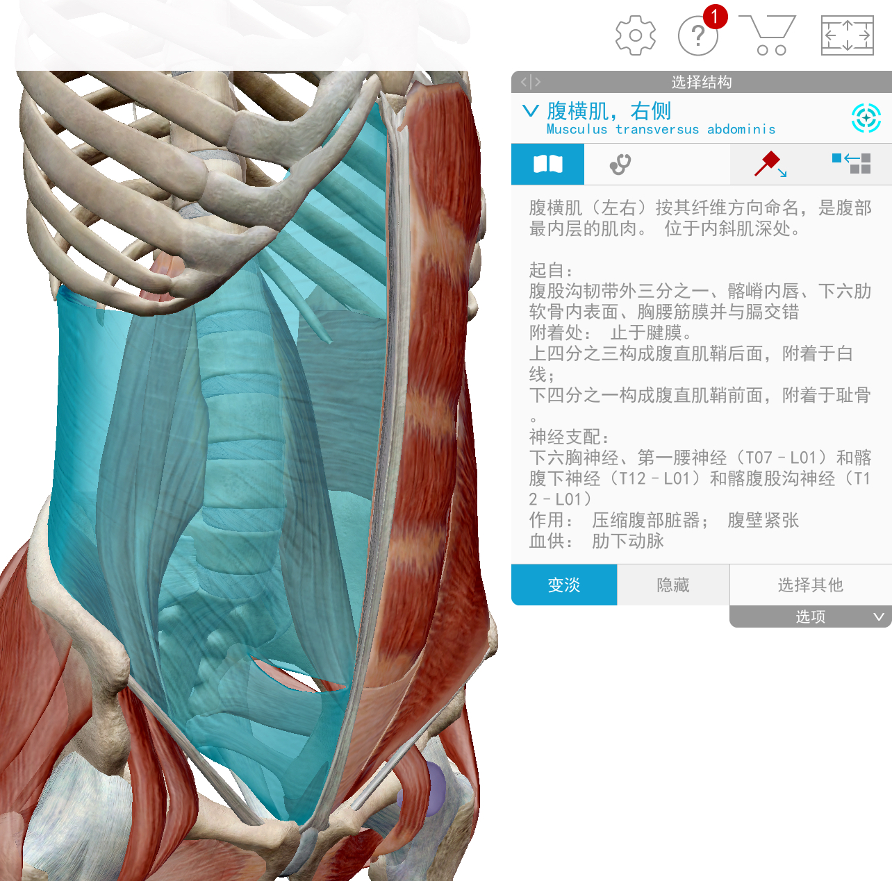
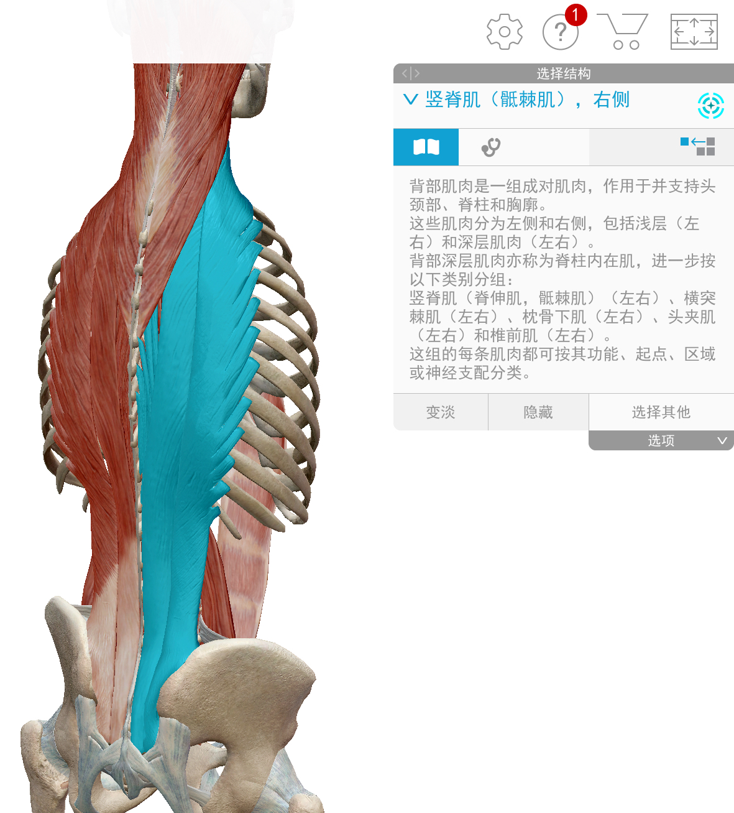
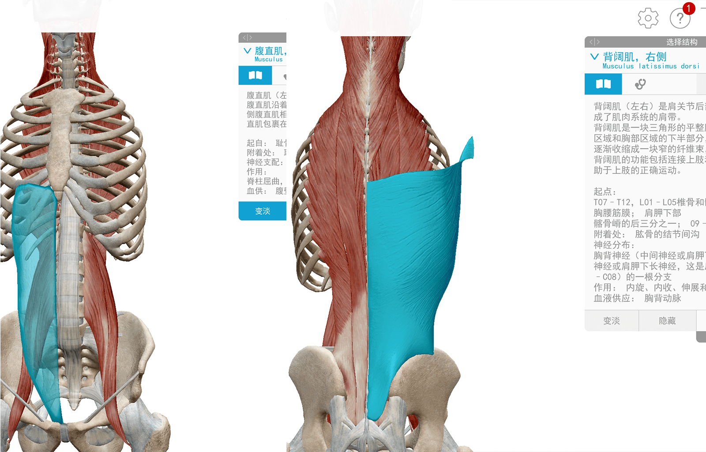

# 功能性训练方案：稳定性灵活性和动作

训练抗阻第一阶段和第二阶段（动作模式）的工具和策略。

人体是适应性的，加到个体身上的负荷会改变人体的发育。活动水平下降，不良姿势或者肌肉的不平衡倾向会改变神经肌肉系统内的正常生理功能，就会引起代偿，最终导致动力链的破坏。

## Move well, move often

## 动作

共同的基本目标就是提高客户的动作效率，以及日常活动的能力（第七章也提到过）。

动力链的存在会让一个错误姿势的后果逐渐放大，也就是代偿。代偿指的是无法维持肌肉平衡和关节中立位（P265）。

人体一般受到的力：外部负荷力，重力，保持稳定自己发的力。

### 灵活性和稳定性的定义

关节稳定性的定义：维持或者控制关节动作或姿势的能力。

关节灵活性：围绕某一关节或身体部位进行**不受限运动的范围**。

小笔记：

1. 缺乏稳定性->可以加强本体感受。本体感受可以让人预测运动和稳定型需求（P263），然后做出必要的运动反应。
2. 韧带已经被拉长的情况，只能加强肌肉来加强稳定性。

**近端稳定性才能提高远端灵活性**。科学一下就是动量的关系。设想发射导弹，平地上发射和在一艘船上哪一个力量更大？

### **运动链中的灵活性与稳定性**[重要]

从上到下的一条链，影响是 joint by joint。

- 盂肱关节——灵活性
- 肩胛胸——稳定性
- 胸椎——灵活性
- 腰椎——稳定性
- 髋关节——灵活性
- 膝关节——稳定性
- 踝关节——灵活性
- 足踝——稳定性

P264：所有关节都有不同程度的灵活性和稳定性，但是往往会出现某一方面比另一方面强一点的情况。例如，腰椎可以转，但是大多数时候都是稳定性。

小笔记：下肢活动一定要放松小腿；上下肢活动都得保证胸椎的灵活性。

### **灵活性不足可能产生的代偿**

- 关节会在**其他运动面产生活动**，以实现期望的关节活动度。
- 临近的**稳定性较高的关节可能牺牲一定的稳定性**，以提高灵活性来完成某个动作。

P265：缺乏灵活性可能的原因（前六个是外因，后四个是内因）

- 外因
    - 重复动作
    - 习惯性不良姿势
    - 工作环境
    - 单侧主导
    - 运动技巧不良
    - 力量训练计划不平衡
- 内因
    - 先天性疾病（脊柱侧凸）
    - 病状（关节炎）
    - 结构偏差（股骨前倾）
    - 创伤（截肢）

这翻译忍不了了。

### 长度—张力关系

长度—张力关系指的是**肌小节的收缩性蛋白**（例如肌动蛋白和肌球蛋白）和**肌力产生能力**的关系。简单记一记：中间最高，太收紧和伸长都没那么有力。

- 表 9-4 P303。静态支撑面的动态动作模式。
- 缩短肌肉的因素
    - 主动
    - 被动
    - 外伤
    - 老化

### 力偶作用关系

- 屈髋肌群，股后肌群
- 竖脊肌，腹直肌

### 神经控制

-  高张性
- 交互抑制作用
- 协同主导效应

## 一期：灵活性与稳定性训练

- 自我筋膜放松术（SMR） 与静态拉伸
    - 5~15cm，30~60s
    - 能重新设定软组织的本体感受机制
    - 静态拉伸：重复至少四次，每次15~60s

- PNF： 原动肌维持等长收缩6s，辅助或东静态拉伸10~30s

- 弹震式拉伸：运动员

- 主动隔离式拉伸：康复训练

- 自生抑制
    - 高尔基腱器官。拉伸7~10s，产生反应。
    - 终止拉伸后，前5秒回复70%
    - 交互抑制原则：主动及收缩或执行主动动作（<50% 1RM）超过6s，拮抗肌就会受到抑制，允许进一步拉伸肌肉。

### 近端稳定性：为了激活核心

此阶段的目标是通过改善核心肌肉组织的反射功能来**提高腰椎的稳定性**。

核心一般指的是腰骶-骨盆-臀部-腹部-下背部的肌肉，核心区域的功能是有效地控制骨盆上方躯干的位置和运动，也就是近端稳定。

三个层

- 深层核心：椎骨和椎间盘；回旋肌，棘间肌，横突间肌。含有大量神经末梢，可以向大脑提供关于本体感受。都在些什么鬼地方啊。棘间肌在椎骨的棘突，横突间肌在下。所以看得出来深层核心其实是稳定脊柱的作用，不怎么发力。

    

- 中间层核心：脊柱下部区域和筋膜。除了下面四个还有膈（与呼吸有关），腹内斜肌的深部纤维。**腹横肌叫做 TVA。**

    

- 最外层核心：更大更有力的肌肉，在躯干内产生大幅的动作和力。包括腹直肌，竖脊肌，腹外/腹内斜肌，髂腰肌以及背阔肌。

    

    一般所說腹肌就是指腹部前側表層的那群腹直肌 (Rectus abdominis)。

    

    竖脊肌分为三部：外侧为髂肋肌iliocostalis，止于肋角；中间为最长肌longissimus，止于横突及其附近肋骨；内侧为棘肌spinalis。

    腹直肌除了美觀，主要的功能是讓身體前彎。腹外斜肌也有美觀的功能，越強壯人魚線就越明顯，他跟腹內斜肌則是主要負責身體旋轉與側彎。

    

髂肌和腰大肌合称髂腰肌。

这么想，越靠里面的力臂越短，肌肉本身也短，造成不了大范围的活动。越靠外面的肌肉长，所以活动范围长，能够造成的动作幅度也就越大。

[重要]**腹横肌（TVA） 没被激活可能在上肢和下肢运动期间不足以稳定腰椎，增加受伤可能性。**于是就会有代偿，需要其协同肌（例如腹直肌）来稳定脊柱。

由于身体的重心处于核心区域内，并且控制平衡需要将重心放在支撑面里，所以训练核心和训练平衡基本相同。下面是一个进阶方案。

#### **训练近端稳定性的动作**

- 仰卧吸腹
- 四足姿势下吸腹并执行肢体动作
    - 目的是对抗重力来激活核心肌肉

### 近端灵活性

- 动作库

## 二期：动作训练

- 动作库