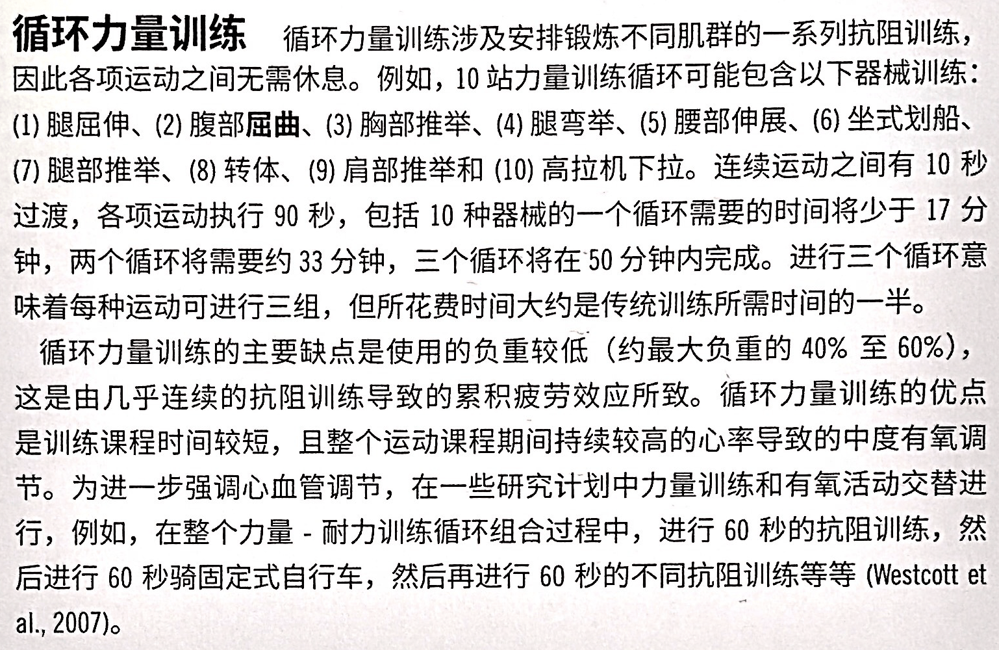

# 抗阻训练：计划和进阶（2）

<!--ts-->
   * [抗阻训练：计划和进阶（2）](#抗阻训练计划和进阶2)
      * [ACE-IFT 的设计思路](#ace-ift-的设计思路)
         * [第一分期：稳定性和灵活性](#第一分期稳定性和灵活性)
         * [第二分期：动作训练](#第二分期动作训练)
            * [逐步增加负荷的建议](#逐步增加负荷的建议)
               * [深蹲](#深蹲)
               * [弓箭步](#弓箭步)
               * [推](#推)
               * [拉](#拉)
               * [旋转](#旋转)
            * [FIRST](#first)
         * [第三分期：负荷训练](#第三分期负荷训练)
            * [肌肥大的特点](#肌肥大的特点)
            * [循环肌群训练法](#循环肌群训练法)
            * [超级组训练法](#超级组训练法)
            * [复合组训练法](#复合组训练法)
            * [分解训练法](#分解训练法)
            * [辅助训练法](#辅助训练法)
         * [第四分期：运动表现](#第四分期运动表现)
      * [小团体训练](#小团体训练)
         * [小团体训练的益处](#小团体训练的益处)
         * [组内的同质性](#组内的同质性)
         * [对每个客户都需要关注](#对每个客户都需要关注)
      * [青年和老年人的特殊注意事项](#青年和老年人的特殊注意事项)
         * [年轻人](#年轻人)
         * [老年人](#老年人)
      * [力量训练设备选择](#力量训练设备选择)
         * [等重量设备](#等重量设备)
         * [拉力器运动/绳索](#拉力器运动绳索)
         * [自由重量运动](#自由重量运动)
            * [壶铃](#壶铃)
            * [药球=实心球](#药球实心球)
         * [弹性阻力运动](#弹性阻力运动)
         * [自重训练/徒手训练](#自重训练徒手训练)
      * [补剂](#补剂)
         * [蛋白质与氨基酸补充剂](#蛋白质与氨基酸补充剂)
         * [beta-丙氨酸（肌肽），碳酸氢钠](#beta-丙氨酸肌肽碳酸氢钠)
         * [咖啡因](#咖啡因)
         * [肌酸](#肌酸)
         * [维生素与矿物质](#维生素与矿物质)
         * [合成类固醇及其复合物（不好）](#合成类固醇及其复合物不好)
      * [常见抗阻训练错误观念[重要]](#常见抗阻训练错误观念重要)

<!-- Added by: oda, at:  -->

<!--te-->

## ACE-IFT 的设计思路

这一部分分四个部分，每一个部分的结构都一样。首先说明这个处于阶段的客户特点，然后说明针对不同目标的方案设计思路，最后给出进展到下一个阶段的标志。

由于运动表现阶段是前一章没有出现的，第四部分最后加入了新的动作。

逻辑是倒着来的，如下：抗阻可以加身材！可以更有力量！可以预防疾病！练啊！

但是怎么练啊？要对抗阻力！但是万一没练到对应的肌肉，代偿了呢？

那就先把动作做对！

### 第一分期：稳定性和灵活性

P347-第九章内容。

### 第二分期：动作训练

P347

**强调动作的重复次数和运动技能的学习**，**而不是负荷**。每月评估，直到客户掌握五个动作。

深蹲练到的肌肉：能锻炼股四头肌（股直肌、股中肌、股外侧肌、股内侧肌）、臀大肌、股二头肌，并对竖脊肌、梨状肌、大收肌、臀中肌、臀小肌及小腿肌等也有很强的作用。

腿部推举的话，加上腘绳肌。

P356

腿屈伸——股四头肌

腿卷曲——腘绳肌

髋伸展——臀大肌

髋内收——髋内收肌群

髋外展——髋外展肌群

#### 逐步增加负荷的建议

##### 深蹲

- 健身球抱在手上
- 哑铃
- 杠铃

##### 弓箭步

- 实心球，哑铃
- 不用弹力带或者杠铃

##### 推

- 弹力带
- 哑铃杠铃
- 抛掷实心球

##### 拉

- 弹力带
- 哑铃

##### 旋转

- 弹力带

- 实心球

- 哑铃

#### FIRST

|             |                                      |
| ----------- | ------------------------------------ |
| Frequency   | 每周2-3天                            |
| Intensity   | 低强度，见第九章                     |
| Repetitions | 重复次数和强度成反比                 |
| Sets        | 单组够了                             |
| Type        | 看客户能不能掌握                     |
| 进阶        | 保持姿势中立、重心稳定、动作速度受控 |

客户一开始学动作的时候会做得很快，因为中间状态稳不住。

### 第三分期：负荷训练

P350，大部分和[10-1](ACE-chap10-1.md#适当的运动量和负荷)里的一样，有价值的只有 Frequency。

|        |                          Frequency                           |  进阶  |
| :----- | :----------------------------------------------------------: | :----: |
| 肌耐力 |        每周2-3天。因为更多 I型肌纤维（疲劳慢速度快）         | 双渐进 |
| 肌力   | 每周两次相同肌群，因为需要72小时来恢复肌肉微伤。 14/25/36和只用两天训练全部，这两个都是可以的。 | 双渐进 |
| 肌肥大 |                           14/25/36                           |        |

| 次数 | 1    | 2    | 3    | 4    | 5    | 6    | 7    | 8    | 9    | 10   | 11   | 12   | 15   |
| ---- | ---- | ---- | ---- | ---- | ---- | ---- | ---- | ---- | ---- | ---- | ---- | ---- | ---- |
| %    | 100  | 95   | 93   | 90   | 87   | 85   | 83   | 80   | 77   | 75   | 70   | 67   | 65   |

#### 肌肥大的特点

- 由于和肌力、肌耐力训练强度重叠，肌肥大训练会同时增加肌力或者肌耐力。
- 健美锻炼中，连续的运动组之间几乎不留休息。应该是说专业的吧。
- P356：组数的选择很多。一般针对一个肌群来说，是用**一个动作**重复**3-6**组；健美运动员的话，针对一个肌群会用**四个动作**重复**3-6**，所以每一个肌群做了**12-24**组。这种方案耗时长，书上说**特别有效**。
- P357：多组训练比单组多次训练有更好的肌肥大效果。

#### 循环肌群训练法

不仅循环肌群，还循环有氧和抗阻。

#### 超级组训练法

在一个肌群的恢复期针对另一个肌群进行训练。比如说，客户在完成一组仰卧推举（练的是胸部、肩部、肱三头肌）的动作之后，立即进行一组坐姿划船（上背部、肱二头肌）的动作。或者交替四组腿屈伸和四组腿弯举。

除了节省时间之外，超级组训练还可以维持较高的代谢反应，因为整个训练期间没有休息，都在进行一定的肌肉活动。

#### 复合组训练法

运动者快速连续的针对相同肌肉进行两次或者更多次的运动。例如，他们可以交替进行三组肱三头肌下压和三组凳上屈伸（仰卧撑）的运动，使得肱三头肌的疲劳和肌肉泵达到较高的水平。

#### 分解训练法

运动者先练肌肉疲劳，然后立即将阻力降低10%或者20%，并且尽量多的进行更多的重复运动，以达到更深层次的肌肉疲劳。

#### 辅助训练法

先练到肌肉疲劳，然后教练在向心收缩的阶段帮助他抬举的情况下，进行3到5次的重复运动，或者控制不了下降了。

注意动作者在离心收缩阶段并没有受到辅助。人们离心收缩的肌肉力量要比向心要高40%。

上面四个高级训练法都不适用于初学者。

### 第四分期：运动表现

见[第十章第三部分](ACE-chap10-3.md)。

## 小团体训练

P372

### 小团体训练的益处

- 每节课的费用更低
- 组内友情增强
- 有机会再小团体环境中接受专业指导（？啥玩意）

### 组内的同质性

整段在说应该安排组内的同质性的理由。

- 这样对每个客户精力一致，没有偏差
- 客户之间不会有太大水平区别，不至于有心理落差
- 客户之间可以相互激励，提高自我效能

### 对每个客户都需要关注

就是说会有这个问题。

## 青年和老年人的特殊注意事项

P374

### 年轻人

- P374，青春期前每周进行两次抗阻训练，八周之后，肌力增加幅度为5倍
- 合格的监督和指导，
- 安全的运动环境，
- 动态运动的训练前热身期，
- 每种抗阻训练1到3组，
- 每组重复6到15次的力量，
- 各种上半身和下半身的力量训练，
- 阻力以5%到10%的程度增加，
- 每周非连续训练两天或者三天，
- 通常使用不太强烈的健身操或者静态拉伸进行训练后放松
- 个人训练日志。

### 老年人

- 10周的规律抗阻训练能让瘦体重增加1.4kg
- 重复10-15次，60-70%1RM
- 以50-60%1RM 的强度对每一项运动做热身
- 避免屏息以及等长收缩（静态姿势承受阻力）。正确的呼吸模式是在向心收缩肌肉动作的时候呼气，离心收缩的时候吸气。
- 因为老年人恢复更慢，每周两次可以了

## 力量训练设备选择

P376

### 等重量设备

比较适合躯干屈曲、躯干伸展，躯干旋转，膝关节屈曲，膝关节伸展，髋内收和髋外展。

固定了运动轨迹的器械。

### 拉力器运动/绳索

自由度比固定器械大，因此在做某个特定动作的时候，需要稳定肌来保持合适的姿势。

肱三头肌下压，滑轮下压，胸部交叉，过头伐木。

### 自由重量运动

- 杠铃/哑铃

深蹲，卧推，上斜卧推。

需要保护。

#### 壶铃

需要额外的专业教育怎么用壶铃

#### 药球=实心球

比较轻，可以抛。

### 弹性阻力运动

弹力绳/松紧带/橡胶管。

适合胸部推举、肩部推举、深蹲（绑在两腿）。

### 自重训练/徒手训练

没有设备：深蹲、平板支撑、俯卧撑。

椅子：凳上双臂屈伸、双杠双臂屈伸、引体向上。

加强度的方法是传负重背心。

## 补剂

P378

### 蛋白质与氨基酸补充剂

增加肌肥大、肌耐力

### beta-丙氨酸（肌肽），碳酸氢钠

pH 缓冲剂，因此增加体能

### 咖啡因

短暂使人精神，提高运动表现。

缺点：身体会做出适应性改变；有些个体服使用之后，效果完了会很难受。

### 肌酸

提高体内肌酸含量，从而提高肌力。

### 维生素与矿物质

没有什么研究发现（发现服不服用都差不多）。基本上饮食均衡的客户（可以提供足够的维生素和矿物质来预防明显的营养缺乏症）不需要。

铁，锌，维生素 B12，核黄素，维生素 D， 钙。

### 合成类固醇及其复合物（不好）

**合成代谢类固醇类**被世界反兴奋剂机构WADA条例严厉禁止。

## 常见抗阻训练错误观念[重要]

P382

- 局部减脂
- 女性可以锻炼出大块肌肉
- 小负荷多次数增加肌力，大重量少次数增加肌肥大。
    - 这个的逻辑比较重要。参见[10-1](ACE-chap10-1.md#适当的运动量和负荷)的解释。
- 年龄太大就无法举重
- 儿童太小无法举重
- 自由重量训练总是优于器械训练
    - 各有千秋
- 停止抗阻训练之后，肌肉就会变为脂肪
    - 组织不会相互转化，只是变化凑巧在一起
- 力量训练对于运动者的血压有不良影响
    - 让血压升高的不是力量训练，而是屏气的呼吸方式。
    - 循环力量训练可以降血压。

