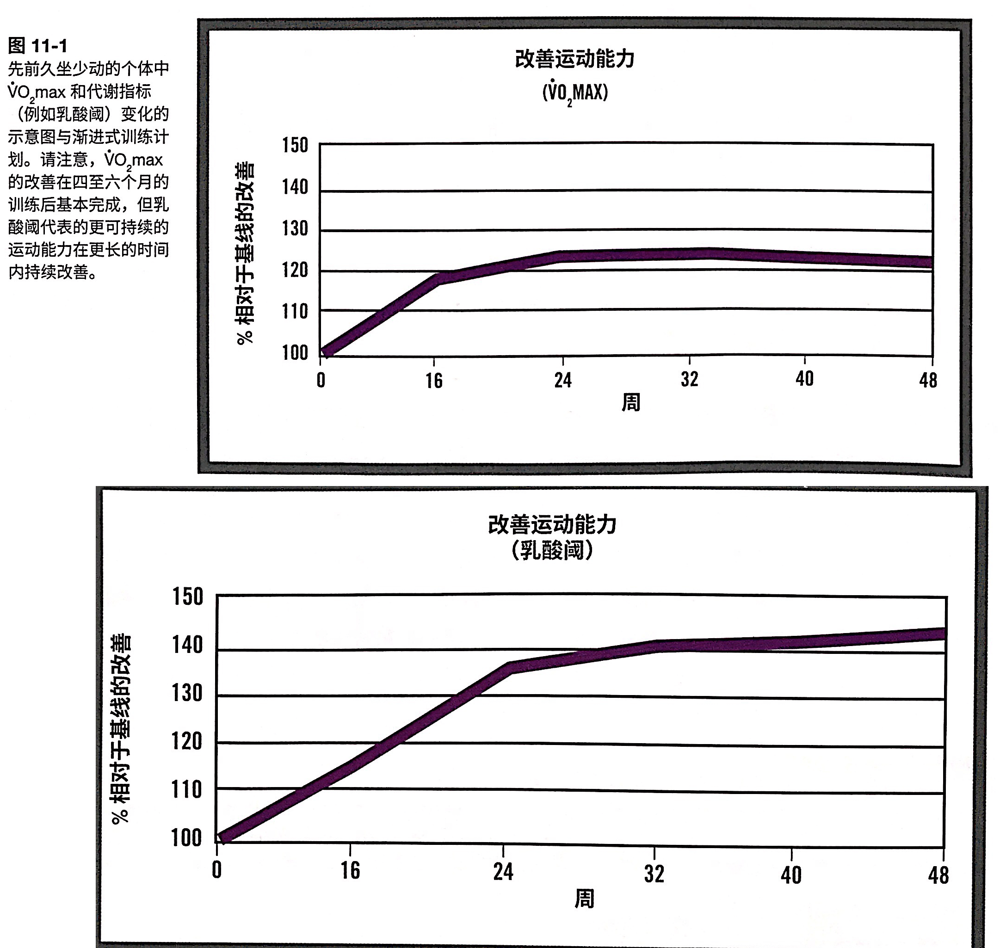

# 心肺训练：计划和进阶

回忆，心肺一期就是让客户动起来

<!--ts-->
   * [心肺训练：计划和进阶](#心肺训练计划和进阶)
      * [心肺运动的长期和短期生理适应](#心肺运动的长期和短期生理适应)
         * [肌肉系统](#肌肉系统)
         * [心血管系统](#心血管系统)
         * [呼吸系统](#呼吸系统)
         * [有氧爆发力](#有氧爆发力)
         * [稳态和间歇性运动的生理适应](#稳态和间歇性运动的生理适应)
      * [心肺训练的课程模块](#心肺训练的课程模块)
         * [热身活动](#热身活动)
         * [调节阶段（体能）](#调节阶段体能)
         * [放松/冷身](#放松冷身)
      * [针对健康、体适能和减肥为目的的一般指南](#针对健康体适能和减肥为目的的一般指南)
         * [频率](#频率)
         * [持续时间](#持续时间)
         * [运动进阶](#运动进阶)
         * [6-17岁青少年运动指南](#6-17岁青少年运动指南)
         * [18-64岁人运动之南](#18-64岁人运动之南)
      * [运动的强度](#运动的强度)
         * [心率](#心率)
         * [自感用力度 RPE](#自感用力度-rpe)
         * [代谢当量（VO2）](#代谢当量vo2)
         * [热量消耗](#热量消耗)
         * [谈话测试](#谈话测试)
      * [心肺运动模式或者类型](#心肺运动模式或者类型)
         * [器械型心血管运动](#器械型心血管运动)
         * [团体运动](#团体运动)
         * [循环训练](#循环训练)
         * [户外运动](#户外运动)
         * [季节性运动](#季节性运动)
         * [水中运动](#水中运动)
         * [身心运动](#身心运动)
         * [生活方式运动](#生活方式运动)
      * [ACE-IFT 实例](#ace-ift-实例)
         * [有氧基础训练](#有氧基础训练)
         * [有氧效率训练](#有氧效率训练)
         * [无氧耐力训练](#无氧耐力训练)
         * [无氧爆发力训练](#无氧爆发力训练)
      * [青年和老年人的特殊事项](#青年和老年人的特殊事项)

<!-- Added by: oda, at:  -->

<!--te-->

## 心肺运动的长期和短期生理适应

### 肌肉系统[重要]

- I 型肌纤维
    - 线粒体大小和数量增加：增加 ATP 生成
    - 募集到的肌纤维周围毛细血管数量增加
- II 型肌纤维
    - 肌纤维肥大
        - 肌动蛋白和肌球蛋白
        - 增加无氧酶数量，提高无氧能力

### 心血管系统

心肌肥大->扩张心室+肌肉变大变强->每搏输出量增加

- 最大心率（MHR） 并不会因为训练而增加

### 呼吸系统

- 肺泡通气量增加

- 与呼吸相关的肌肉分布

    - 横膈膜，与被动（或者叫静息）吸气有关
    - 向上拉伸胸廓的肌群，与主动（或者运动中）**吸气**有关
    - 向下拉伸胸廓的肌群，与主动**呼气**有关

     

### 有氧爆发力的变化[重要]

- 最大摄氧量（VO2max）在训练六个月的时候**达到平台期**
- 通气阈（VT）的变化可以持续很久

通气阈、乳酸阈、VO2max 是 EES 的内容，还没看。

### 稳态和间歇性运动的生理适应

- 个体需要45s-4min 达到稳定状态

## 心肺训练的课程模块

### 热身活动

### 调节阶段（体能）

### 放松/冷身

## 针对健康、体适能和减肥为目的的一般指南

### 频率

- 中强度：每周5天
- 高强度：每周3天
- 中高结合：3-5天

### 持续时间

- 每次运动至少坚持10分钟
- 每周>=1000kcal，可以改善健康状况
- 每周>=2000kcal，有效促进减重并显著提高总体体适能水平
- 普通人群（见频率）
- 超重者与希望控制体重的人
    - 中等强度：每周5-7天，50-60min
    - 剧烈强度：每周3天，50min
    - 两种强度交替

### 运动进阶

- 超负荷原则
- SAID 原则=专一性原则
    - 机体所做出的生理性适应行为因人而异

### 6-17岁青少年运动指南

- 每天进行至少一个小时中等强度的运动
- 每周至少三天剧烈运动
- 每周至少三天参加强化肌肉和骨骼的活动

### 18-64岁人运动之南

- 每周150min 中等强度
- 每周75min 高强度
- 超过上述运动量的话，身体会获得更多的益处
- 每次有氧运动持续时间至少10min
- 每周至少两天要强化大肌群

## 运动的强度

### 心率

- 最大心率
    - 影响最大心率的多种变量
        - 遗传因素
        - 运动模式
        - 药物
        - 身体尺寸
        - 海拔
        - 年龄
    - 不要按照凭年龄计算的最大心率来指导训练
    - 220-年龄是平均值
        - 68%的人群在±12次内
        - 95%的人群在±24次内
    - Gellish et al: 206.9-(0.67*年龄)
        - ±7次
- 心率储备（HRR）
    - 卡氏公式
        - THR=（HRR*训练强度%）+RHR
        - HRR=MHR-RHR
    - 准确性
        - MHR
        - 测量静息心率的身体姿势

### 自感用力度 RPE

- 经典量表（6-19）对应心率
- 改良版（0-10）
- 强度
    - 中等强度：70%的储备心率
    - 略难：80%
    - 困难：85%

### 代谢当量（VO2）

- VT1：最低有效训练刺激强度
- MET： 梅脱，3.5ml/(kg×min)
    - 轻度：<3
    - 中度：3-6
    - 高度：>6

### 热量消耗

### 谈话测试

-  VT1 
- 血乳酸堆积 OBLA
    - 4mmol/L 成为 OBLA 标准值
    - 刚好低于 OBLA的运动强度表示运动者可以维持的最大运动强度，通常可以持续20-30min

## 心肺运动模式或者类型

### 器械型心血管运动

### 团体运动

### 循环训练

### 户外运动

### 季节性运动

### 水中运动

### 身心运动

### 生活方式运动

## ACE-IFT 实例

记住P422的表格，其它不用看，身心运动不用看了

### 有氧基础训练

### 有氧效率训练

### 无氧耐力训练

+ 训练重点
    + 5-10%的训练在 VT2以上
    + 至少每周七小时的心肺训练
+ 训练设计
    + 提高无氧耐力水平，有助于延长在 VT2的时间
    + 训练量应该逐渐增大，每周增幅小于10%；每周的训练时间达到运动者参加的赛事时间的三倍
    + 3区强度的 RPE>7

### 无氧爆发力训练

- 训练重点
    - 只有体适能水平很高，目标与耐力项目中需要高速体能表现的竞技性运动者，才需要进入4期
    - 如果磷酸原储备大量持续性消耗且形成乳酸堆积，则机体需要更多的磷酸原储备和更多的缓冲物质储备来进行适应
    - 设定有着较短恢复期的高强度运动
- 训练设计
    - 短暂的高强度（RPE9-10）的训练结束后，需要10-20倍的休息时间

## 青年和老年人的特殊事项

